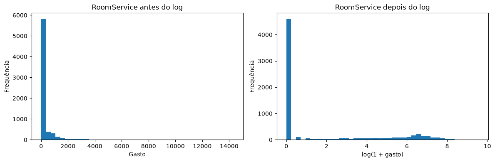
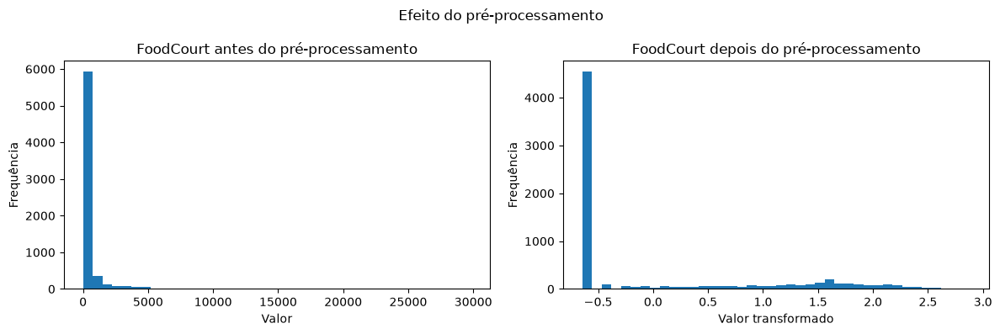

```python
import numpy as np
import pandas as pd
from sklearn.model_selection import train_test_split
from sklearn.impute import SimpleImputer
from sklearn.preprocessing import OneHotEncoder
from sklearn.preprocessing import StandardScaler
import matplotlib.pyplot as plt
from pathlib import Path
```


```python
figures = Path.cwd().parent / "figures"
figures.mkdir(parents=True, exist_ok=True)
```


```python
df = pd.read_csv("train.csv")
```


```python
df.head()
```


<div>
<style scoped>
    .dataframe tbody tr th:only-of-type {
        vertical-align: middle;
    }

    .dataframe tbody tr th {
        vertical-align: top;
    }

    .dataframe thead th {
        text-align: right;
    }
</style>
<table border="1" class="dataframe">
  <thead>
    <tr style="text-align: right;">
      <th></th>
      <th>PassengerId</th>
      <th>HomePlanet</th>
      <th>CryoSleep</th>
      <th>Cabin</th>
      <th>Destination</th>
      <th>Age</th>
      <th>VIP</th>
      <th>RoomService</th>
      <th>FoodCourt</th>
      <th>ShoppingMall</th>
      <th>Spa</th>
      <th>VRDeck</th>
      <th>Name</th>
      <th>Transported</th>
    </tr>
  </thead>
  <tbody>
    <tr>
      <th>0</th>
      <td>0001_01</td>
      <td>Europa</td>
      <td>False</td>
      <td>B/0/P</td>
      <td>TRAPPIST-1e</td>
      <td>39.0</td>
      <td>False</td>
      <td>0.0</td>
      <td>0.0</td>
      <td>0.0</td>
      <td>0.0</td>
      <td>0.0</td>
      <td>Maham Ofracculy</td>
      <td>False</td>
    </tr>
    <tr>
      <th>1</th>
      <td>0002_01</td>
      <td>Earth</td>
      <td>False</td>
      <td>F/0/S</td>
      <td>TRAPPIST-1e</td>
      <td>24.0</td>
      <td>False</td>
      <td>109.0</td>
      <td>9.0</td>
      <td>25.0</td>
      <td>549.0</td>
      <td>44.0</td>
      <td>Juanna Vines</td>
      <td>True</td>
    </tr>
    <tr>
      <th>2</th>
      <td>0003_01</td>
      <td>Europa</td>
      <td>False</td>
      <td>A/0/S</td>
      <td>TRAPPIST-1e</td>
      <td>58.0</td>
      <td>True</td>
      <td>43.0</td>
      <td>3576.0</td>
      <td>0.0</td>
      <td>6715.0</td>
      <td>49.0</td>
      <td>Altark Susent</td>
      <td>False</td>
    </tr>
    <tr>
      <th>3</th>
      <td>0003_02</td>
      <td>Europa</td>
      <td>False</td>
      <td>A/0/S</td>
      <td>TRAPPIST-1e</td>
      <td>33.0</td>
      <td>False</td>
      <td>0.0</td>
      <td>1283.0</td>
      <td>371.0</td>
      <td>3329.0</td>
      <td>193.0</td>
      <td>Solam Susent</td>
      <td>False</td>
    </tr>
    <tr>
      <th>4</th>
      <td>0004_01</td>
      <td>Earth</td>
      <td>False</td>
      <td>F/1/S</td>
      <td>TRAPPIST-1e</td>
      <td>16.0</td>
      <td>False</td>
      <td>303.0</td>
      <td>70.0</td>
      <td>151.0</td>
      <td>565.0</td>
      <td>2.0</td>
      <td>Willy Santantines</td>
      <td>True</td>
    </tr>
  </tbody>
</table>
</div>


```python
class_count = df["Transported"].value_counts()
class_percentage = df["Transported"].value_counts(normalize=True) * 100

balance = pd.DataFrame({
    "Quantidade": class_count,
    "Percentual": class_percentage
})

balance
```


<div>
<style scoped>
    .dataframe tbody tr th:only-of-type {
        vertical-align: middle;
    }

    .dataframe tbody tr th {
        vertical-align: top;
    }

    .dataframe thead th {
        text-align: right;
    }
</style>
<table border="1" class="dataframe">
  <thead>
    <tr style="text-align: right;">
      <th></th>
      <th>Quantidade</th>
      <th>Percentual</th>
    </tr>
    <tr>
      <th>Transported</th>
      <th></th>
      <th></th>
    </tr>
  </thead>
  <tbody>
    <tr>
      <th>True</th>
      <td>4378</td>
      <td>50.362361</td>
    </tr>
    <tr>
      <th>False</th>
      <td>4315</td>
      <td>49.637639</td>
    </tr>
  </tbody>
</table>
</div>


```python
numeric_features = [
    "Age",
    "RoomService",
    "FoodCourt",
    "ShoppingMall",
    "Spa",
    "VRDeck"
]

categorical_features = [
    "HomePlanet",
    "CryoSleep",
    "Destination",
    "VIP"
]

id_features = [
    "PassangerId",
    "Name"
]

```

Valores Faltantes


```python
missing_values = pd.DataFrame({
    "Quantity": df.isna().sum(),
    "Percentual": df.isna().mean() * 100
})

missing_values
```


<div>
<style scoped>
    .dataframe tbody tr th:only-of-type {
        vertical-align: middle;
    }

    .dataframe tbody tr th {
        vertical-align: top;
    }

    .dataframe thead th {
        text-align: right;
    }
</style>
<table border="1" class="dataframe">
  <thead>
    <tr style="text-align: right;">
      <th></th>
      <th>Quantity</th>
      <th>Percentual</th>
    </tr>
  </thead>
  <tbody>
    <tr>
      <th>PassengerId</th>
      <td>0</td>
      <td>0.000000</td>
    </tr>
    <tr>
      <th>HomePlanet</th>
      <td>201</td>
      <td>2.312205</td>
    </tr>
    <tr>
      <th>CryoSleep</th>
      <td>217</td>
      <td>2.496261</td>
    </tr>
    <tr>
      <th>Cabin</th>
      <td>199</td>
      <td>2.289198</td>
    </tr>
    <tr>
      <th>Destination</th>
      <td>182</td>
      <td>2.093639</td>
    </tr>
    <tr>
      <th>Age</th>
      <td>179</td>
      <td>2.059128</td>
    </tr>
    <tr>
      <th>VIP</th>
      <td>203</td>
      <td>2.335212</td>
    </tr>
    <tr>
      <th>RoomService</th>
      <td>181</td>
      <td>2.082135</td>
    </tr>
    <tr>
      <th>FoodCourt</th>
      <td>183</td>
      <td>2.105142</td>
    </tr>
    <tr>
      <th>ShoppingMall</th>
      <td>208</td>
      <td>2.392730</td>
    </tr>
    <tr>
      <th>Spa</th>
      <td>183</td>
      <td>2.105142</td>
    </tr>
    <tr>
      <th>VRDeck</th>
      <td>188</td>
      <td>2.162660</td>
    </tr>
    <tr>
      <th>Name</th>
      <td>200</td>
      <td>2.300702</td>
    </tr>
    <tr>
      <th>Transported</th>
      <td>0</td>
      <td>0.000000</td>
    </tr>
  </tbody>
</table>
</div>


```python
missing_values[missing_values["Quantity"] > 0]
```


<div>
<style scoped>
    .dataframe tbody tr th:only-of-type {
        vertical-align: middle;
    }

    .dataframe tbody tr th {
        vertical-align: top;
    }

    .dataframe thead th {
        text-align: right;
    }
</style>
<table border="1" class="dataframe">
  <thead>
    <tr style="text-align: right;">
      <th></th>
      <th>Quantity</th>
      <th>Percentual</th>
    </tr>
  </thead>
  <tbody>
    <tr>
      <th>HomePlanet</th>
      <td>201</td>
      <td>2.312205</td>
    </tr>
    <tr>
      <th>CryoSleep</th>
      <td>217</td>
      <td>2.496261</td>
    </tr>
    <tr>
      <th>Cabin</th>
      <td>199</td>
      <td>2.289198</td>
    </tr>
    <tr>
      <th>Destination</th>
      <td>182</td>
      <td>2.093639</td>
    </tr>
    <tr>
      <th>Age</th>
      <td>179</td>
      <td>2.059128</td>
    </tr>
    <tr>
      <th>VIP</th>
      <td>203</td>
      <td>2.335212</td>
    </tr>
    <tr>
      <th>RoomService</th>
      <td>181</td>
      <td>2.082135</td>
    </tr>
    <tr>
      <th>FoodCourt</th>
      <td>183</td>
      <td>2.105142</td>
    </tr>
    <tr>
      <th>ShoppingMall</th>
      <td>208</td>
      <td>2.392730</td>
    </tr>
    <tr>
      <th>Spa</th>
      <td>183</td>
      <td>2.105142</td>
    </tr>
    <tr>
      <th>VRDeck</th>
      <td>188</td>
      <td>2.162660</td>
    </tr>
    <tr>
      <th>Name</th>
      <td>200</td>
      <td>2.300702</td>
    </tr>
  </tbody>
</table>
</div>


```python
df.isna().mean() * 100
```


    PassengerId     0.000000
    HomePlanet      2.312205
    CryoSleep       2.496261
    Cabin           2.289198
    Destination     2.093639
    Age             2.059128
    VIP             2.335212
    RoomService     2.082135
    FoodCourt       2.105142
    ShoppingMall    2.392730
    Spa             2.105142
    VRDeck          2.162660
    Name            2.300702
    Transported     0.000000
    dtype: float64


Gastos


```python
spending_columns = [
    "RoomService",
    "FoodCourt",
    "ShoppingMall",
    "Spa",
    "VRDeck"
]

spending_statistics = df[spending_columns].agg([
    "mean",
    "median",
    "max"
]).T

spending_statistics
```


<div>
<style scoped>
    .dataframe tbody tr th:only-of-type {
        vertical-align: middle;
    }

    .dataframe tbody tr th {
        vertical-align: top;
    }

    .dataframe thead th {
        text-align: right;
    }
</style>
<table border="1" class="dataframe">
  <thead>
    <tr style="text-align: right;">
      <th></th>
      <th>mean</th>
      <th>median</th>
      <th>max</th>
    </tr>
  </thead>
  <tbody>
    <tr>
      <th>RoomService</th>
      <td>224.687617</td>
      <td>0.0</td>
      <td>14327.0</td>
    </tr>
    <tr>
      <th>FoodCourt</th>
      <td>458.077203</td>
      <td>0.0</td>
      <td>29813.0</td>
    </tr>
    <tr>
      <th>ShoppingMall</th>
      <td>173.729169</td>
      <td>0.0</td>
      <td>23492.0</td>
    </tr>
    <tr>
      <th>Spa</th>
      <td>311.138778</td>
      <td>0.0</td>
      <td>22408.0</td>
    </tr>
    <tr>
      <th>VRDeck</th>
      <td>304.854791</td>
      <td>0.0</td>
      <td>24133.0</td>
    </tr>
  </tbody>
</table>
</div>


Todas as colunas de gasto apresentam mediana igual a zero, indicando que pelo menos metade dos passageiros não realizou gastos nesses serviços. Entretanto, as médias são positivas e variam aproximadamente entre 174 e 458, pois uma pequena quantidade de passageiros possui gastos muito elevados, com máximos entre 14 mil e 30 mil. Essa grande diferença entre média e mediana indica distribuições bastante espalhadas e assimétricas à direita: há uma forte concentração de valores em zero e uma cauda longa formada por poucos gastos extremos.

B


```python
X = df.drop(columns="Transported")
Y = df["Transported"]
```


```python
x_train, x_test, y_train, y_test = train_test_split(X, Y, test_size=0.20, train_size=0.8, stratify=Y, random_state=42)
```


```python
print("Treino:", x_train.shape)
print("Teste:", x_test.shape)

print("\nProporção no treino:")
print(y_train.value_counts(normalize=True))

print("\nProporção no teste:")
print(y_test.value_counts(normalize=True))
```

    Treino: (6954, 13)
    Teste: (1739, 13)
    
    Proporção no treino:
    Transported
    True     0.503595
    False    0.496405
    Name: proportion, dtype: float64
    
    Proporção no teste:
    Transported
    True     0.503738
    False    0.496262
    Name: proportion, dtype: float64
    

A separação deve acontecer antes da imputação e do escalonamento para que as estatísticas utilizadas nessas transformações sejam calculadas apenas com os dados de treino. Caso a mediana, a média ou o desvio-padrão sejam calculados usando também o conjunto de teste, informações do teste influenciam a preparação do modelo, causando vazamento de dados. Isso produz uma avaliação excessivamente otimista e menos confiável.

C


```python
columns_to_drop = ["Cabin", "Name", "PassengerId"]

x_train = x_train.drop(columns=columns_to_drop).copy()
x_test = x_test.drop(columns=columns_to_drop).copy()
```


```python
numeric_columns = [
    "Age",
    "RoomService",
    "FoodCourt",
    "ShoppingMall",
    "Spa",
    "VRDeck"
]

categorical_columns = [
    "HomePlanet",
    "CryoSleep",
    "Destination",
    "VIP"
]

spending_columns = [
    "RoomService",
    "FoodCourt",
    "ShoppingMall",
    "Spa",
    "VRDeck"
]
```


```python
numeric_imputer = SimpleImputer(strategy="median")

x_train[numeric_columns] = numeric_imputer.fit_transform(
    x_train[numeric_columns]
)

x_test[numeric_columns] = numeric_imputer.transform(
    x_test[numeric_columns]
)
```


```python
categorical_imputer = SimpleImputer(strategy="most_frequent")

x_train[categorical_columns] = categorical_imputer.fit_transform(
    x_train[categorical_columns]
)

x_test[categorical_columns] = categorical_imputer.transform(
    x_test[categorical_columns]
)
```

Nas features numéricas, os valores faltantes foram preenchidos com a mediana, pois ela é menos sensível aos valores extremos presentes nas colunas de gasto. Nas features categóricas, foi utilizada a categoria mais frequente, mantendo os valores dentro das categorias já existentes. Os imputadores foram ajustados somente no treino e aplicados ao teste para evitar vazamento de dados.


```python
x_train["TotalSpend"] = x_train[spending_columns].sum(axis=1)
x_test["TotalSpend"] = x_test[spending_columns].sum(axis=1)
```


```python
room_service_before = x_train["RoomService"].copy()
```


```python
x_train[spending_columns] = np.log1p(
    x_train[spending_columns]
)

x_test[spending_columns] = np.log1p(
    x_test[spending_columns]
)
```


```python
fig, axes = plt.subplots(1, 2, figsize=(12, 4))

axes[0].hist(room_service_before, bins=40)
axes[0].set_title("RoomService antes do log")
axes[0].set_xlabel("Gasto")
axes[0].set_ylabel("Frequência")

axes[1].hist(x_train["RoomService"], bins=40)
axes[1].set_title("RoomService depois do log")
axes[1].set_xlabel("log(1 + gasto)")
axes[1].set_ylabel("Frequência")

plt.tight_layout()
plt.savefig(figures / 'RoomService_before_after_log.png',  dpi=300, bbox_inches='tight')
plt.show()
```


    

    


A transformação logarítmica reduz a diferença entre os gastos comuns e os valores extremamente altos, deixando a distribuição menos assimétrica. Isso evita entradas exageradamente grandes, que poderiam levar a `tanh` para suas regiões saturadas, onde ela aprende mais lentamente.

Conversao categoria -> numero


```python
encoder = OneHotEncoder(
    handle_unknown="ignore",
    sparse_output=False
)

train_categorical = encoder.fit_transform(
    x_train[categorical_columns]
)

test_categorical = encoder.transform(
    x_test[categorical_columns]
)
```

Padronizar numericas


```python
final_numeric_columns = numeric_columns + ["TotalSpend"]
```


```python
scaler = StandardScaler()

train_numeric = scaler.fit_transform(
    x_train[final_numeric_columns]
)

test_numeric = scaler.transform(
    x_test[final_numeric_columns]
)
```


```python
print(f"Treino — mínimo: {train_numeric.min():.4f}")
print(f"Treino — máximo: {train_numeric.max():.4f}")

print(f"Teste — mínimo: {test_numeric.min():.4f}")
print(f"Teste — máximo: {test_numeric.max():.4f}")
```

    Treino — mínimo: -1.9961
    Treino — máximo: 12.5430
    Teste — mínimo: -1.9961
    Teste — máximo: 9.6711
    

Foi utilizada a padronização com StandardScaler, que transforma as features para que apresentem média próxima de zero e desvio-padrão próximo de um. Essa transformação reduz diferenças de escala entre as features e concentra grande parte dos valores na região central da tanh, onde seus gradientes são maiores. Após a transformação, os valores variaram de [mínimo] a [máximo] no treino e de [mínimo] a [máximo] no teste.

Juntando numericas e categoricas


```python
X_train_processed = np.hstack([
    train_numeric,
    train_categorical
])

X_test_processed = np.hstack([
    test_numeric,
    test_categorical
])
```


```python
print(X_train_processed.shape)
print(X_test_processed.shape)

print("Valores faltantes no treino:",
      np.isnan(X_train_processed).sum())

print("Valores faltantes no teste:",
      np.isnan(X_test_processed).sum())
```

    (6954, 17)
    (1739, 17)
    Valores faltantes no treino: 0
    Valores faltantes no teste: 0
    

D


```python
foodcourt_before = df.loc[x_train.index, "FoodCourt"].dropna()

foodcourt_index = final_numeric_columns.index("FoodCourt")
foodcourt_after = train_numeric[:, foodcourt_index]

fig, axes = plt.subplots(1, 2, figsize=(12, 4))

axes[0].hist(foodcourt_before, bins=40)
axes[0].set_title("FoodCourt antes do pré-processamento")
axes[0].set_xlabel("Valor")
axes[0].set_ylabel("Frequência")

axes[1].hist(foodcourt_after, bins=40)
axes[1].set_title("FoodCourt depois do pré-processamento")
axes[1].set_xlabel("Valor transformado")
axes[1].set_ylabel("Frequência")

fig.suptitle("Efeito do pré-processamento")
plt.tight_layout()
plt.savefig(figures / 'pre_processing_effect.png',  dpi=300, bbox_inches='tight')
plt.show()
```


    

    


```python
print("NaNs no treino:", np.isnan(X_train_processed).sum())
print("NaNs no teste:", np.isnan(X_test_processed).sum())

print("Shape do treino:", X_train_processed.shape)
print("Shape do teste:", X_test_processed.shape)

print(
    f"Intervalo no treino: "
    f"[{X_train_processed.min():.4f}, "
    f"{X_train_processed.max():.4f}]"
)

print(
    f"Intervalo no teste: "
    f"[{X_test_processed.min():.4f}, "
    f"{X_test_processed.max():.4f}]"
)
```

    NaNs no treino: 0
    NaNs no teste: 0
    Shape do treino: (6954, 17)
    Shape do teste: (1739, 17)
    Intervalo no treino: [-1.9961, 12.5430]
    Intervalo no teste: [-1.9961, 9.6711]
    

As decisões com maior impacto no treinamento são a transformação logarítmica e a padronização das features numéricas. O log reduz a influência dos gastos extremamente altos e torna suas distribuições menos assimétricas, enquanto a padronização impede que features de maior escala dominem as demais. Essas transformações concentram os valores em uma faixa mais adequada para a tanh, reduzindo sua saturação e facilitando o aprendizado da rede.


```python
minimum = X_train_processed.min()
maximum = X_train_processed.max()

print(f"Faixa das features: [{minimum:.4f}, {maximum:.4f}]")
```

    Faixa das features: [-1.9961, 12.5430]
    
