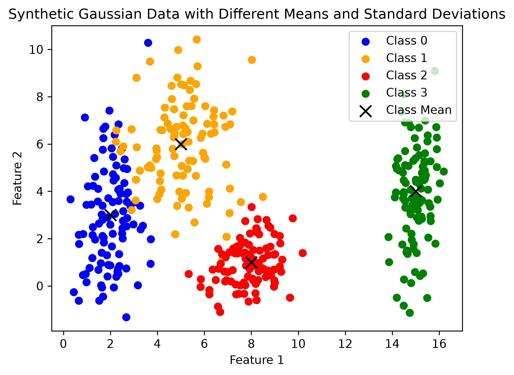
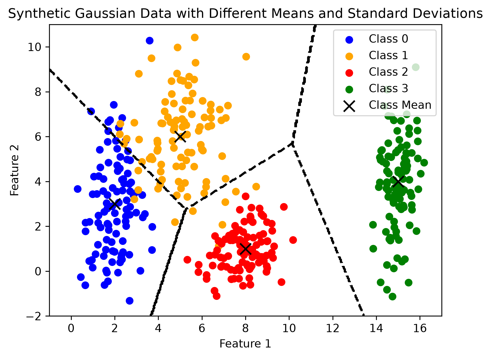
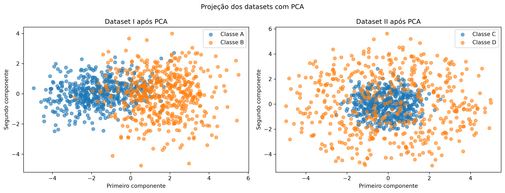
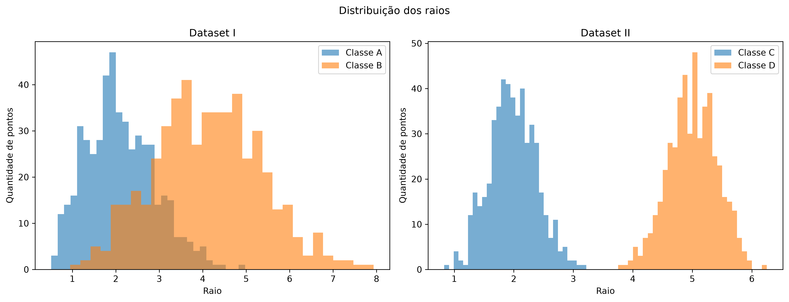
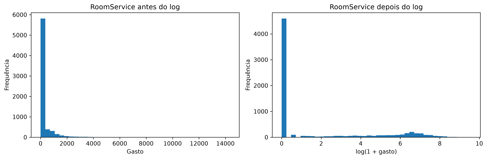
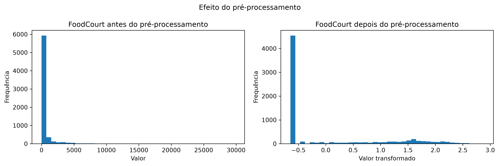
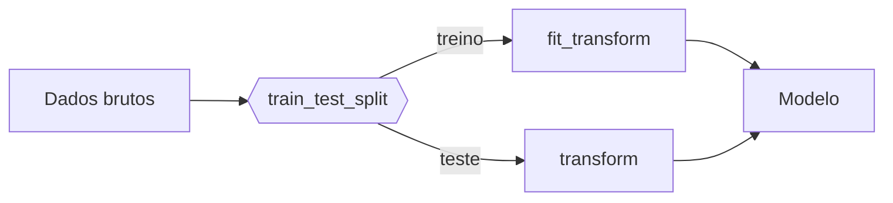

# 1. Data

!!! abstract "Enunciado"

    [Exercises → Data](https://insper.github.io/ann-dl/){:target='_blank'}

!!! tip "Este arquivo é o modelo de relatório"

## Exercise 1

### Abordagem

Os dados foram gerados utilizando o `rng.normal` e preenchendo a média (parâmetro loc), o desvio padrão (parâmetro scale) e o número de amostras (parâmetro size), todos dados no enunciado, realiza uma distribuição gaussiana (normal) e cria 100 amostras aleatórias de cada uma das 4 classes. Além disso, para alterar o quanto cada núvem espalha, o exercício dá um fator de escala e com isso, foram realizados 4 subgráficos com os desvios padrão multiplicados por cada fator de escala. A semente aleatória `seed=42` foi utilizada para garantir que os mesmos dados fossem reproduzidos.

### Código

O script vive em [`code/exercise1_point_clouds.py`](https://github.com/usuario/ann-dl/blob/main/docs/exercises/data/code/exercise1_point_clouds.py)
e é incluído aqui pelo próprio arquivo — nunca copie e cole o texto do código, use a
inclusão para que relatório e repositório nunca fiquem fora de sincronia.

``` { .python .copy .select linenums='1' title="docs/exercises/data/code/exercise1_point_clouds.py" }
--8<-- "docs/exercises/data/code/exercise1_point_clouds.py"
```

### Figuras


/// caption
**Figura 1** — Scatter plot 2D com todos os pontos, uma cor por classe, com o centro de cada núvem (média) marcado sobre o gráfico.
///


/// caption
**Figura 2** - 4 subplots (um por valor de `s`), compartilhando os mesmos limites de eixos, para que a comparação seja honesta.
///


/// caption
**Figura 3** - Gráfico de taxa de mistura x `s`.
///

A partir do fator `s`= 1 que as núvens começam a deixam de poder ser separadas por retas, pois a razão de mistura entre as classes começa a ser maior que 0, no caso, 0.0675.


///caption
**Figura adicional** - Scatter plot 2D com as fronteiras de decisão marcadas
///

### Análise

1. A sobreposição das quatro classes no dataset original ocorre de forma mais presente entre as classes 0, 1 e 2, especialmente as classes 0 e 1. No entanto, a classe 3 encontra-se totalmente isolada das demais. Uma única fronteira linear não seria o suficiente para separar todas as classes e um conjunto de de fronteiras lineares não seria perfeita para separar as classes 0 e 1 e classes 1 e 2, devido à sobreposição.

2. Figura adicional em Figuras.

3. Quanto mais espalhadas as núvens, maior é a região onde a rede necessariamente erra fica. Como pontos de diferentes classes ocupam posições similares, a reta não consegue distinguir exatamente de qual ponto é a classe deveria estar.

## Exercise 2

### Abordagem

Foram geradas 500 amostras em 5 dimensões para cada classe, utilizando a semente aleatória 42 para garantir a reprodutibilidade. As direções foram obtidas a partir de vetores gaussianos aleatórios, depois normalizados para terem comprimento 1. Para a classe C, foram utilizados raio com média 2,0 e desvio padrão de 0,4; para a classe D, utilizou o mesmo desvio padrão de 0,4, mas a média utilizada foi 5,0. Por fim, cada ponto foi criado multiplicando sua direção pelo raio sorteado, x=ρu, formando um núcleo e uma casca externa.

### Código

``` { .python .copy .select linenums='1' title="docs/exercises/data/code/exercise2_non_linear_dimensions.py" }
--8<-- "docs/exercises/data/code/exercise2_non_linear_dimensions.py"
```

### Figuras


///caption
**Figura 4** - Aplicação da PCA para projeção dos datasets em 2D
///

Após a aplicação da PCA, o Dataset I mantém uma separação horizontal entre as classes A e B, apesar da sobreposição. O primeiro componente do Dataset I explica 50,04% da variância e o segundo explica 15,93%, totalizando 65,97%. No Dataset II, a classe C permanece concentrada no centro, enquanto a classe D expandiu e ocupa regiões mais afastadas, o que evidencia a sua estrutura radial. O PC1 do Dataset 2 explica 21,83% e o PC2 21,32%, somando 43,16%. Todavia, a projeção em duas dimensões descarta parte das distâncias nas outras três dimensões. 



///caption
**Figura 5** - Histograma do raio ||*x*|| de cada ponto
///

### Análise

1. Apesar dos centros de ambas classes serem iguais, os histogramas mostram que elas possuem raios diferentes, já que a classe D envolve a classe C em todas as direções, o que comprova que as classes são separáveis pela distância à origemm mas não por um único hiperplano. Para conseguir separá-los, seria necessária uma fronteira não-linear para colocar a classe C dentro e a classe D fora.

2. Por mais dados que se colete, o Dataset II não pode ser resolvido por uma fronteira linear, pois a classe D engloba a classe C em todas as direções. E criar uma fronteira linear deixaria mais evidente a "casca" criada pela classe D. Logo, a solução seria criar uma fronteira não-linear, baseada na distância dos pontos ao centro.

3. Não necessariamente. Uma projeção 2D não prova que elas são inseparáveis no espaço original, pois ao reduzir a dimensionalidade dos dados, pode descartar informações presentes nas outras dimensões e fazer com que pontos que estavam originalmente distantes parecerem estar misturados. No Dataset II, os dois componentes principais preservam apenas 43,15% da variância; portanto, o gráfico de Bowling não representa toda a estrutura 5D. Embora as classes não possam ser separadas por um hiperplano, elas podem ser distinguidas por uma função não linear baseada em \(f(x)=\|x\|^2\), classificando como C os pontos de raio menor e como D os de raio maior.

!!! note "Fronteiras não lineares"

    Para justificar por que as cascas concêntricas exigem fronteira não linear, ajuda
    escrever a condição de decisão. Um separador linear é

    $$
    f(\mathbf{x}) = \mathbf{w}^\top \mathbf{x} + b,
    $$

    enquanto a estrutura das cascas depende de $\lVert \mathbf{x} - \boldsymbol{\mu} \rVert$,
    que não é expressável nessa forma.

## Exercise 3

### Abordagem

Foi utilizado o `train.csv` do Spaceship Titanic, separando os dados em 80% para treino e 20% para teste de forma estratificada, com semente 42. Os valores numéricos ausentes foram preenchidos com a mediana e os categóricos com a moda, sempre ajustando as transformações apenas no treino. As colunas identificadoras foram descartadas, criou-se `TotalSpend`, e os gastos receberam a transformação \(\log(1+x)\). Por fim, as categorias foram convertidas com one-hot encoding e as features numéricas foram padronizadas para adequá-las à rede com ativação `tanh`.

### Código

``` { .python .copy .select linenums='1' title="docs/exercises/data/code/exercise3_preparing_data.py" }
--8<-- "docs/exercises/data/code/exercise3_preparing_data.py"
```


### Figuras


///caption
**Histograma Item C** - Histograma de antes e depois da aplicação do log(1+x).
///

///caption
**Figura 6** - Histograma de uma feature de cauda pesada antes e depois do pré-processamento.
///


### Análise

1. Figura 6 em figuras

2. 
```
NaNs no treino: 0
NaNs no teste: 0
Shape do treino: (6954, 17)
Shape do teste: (1739, 17)
Intervalo no treino: [-1.9961, 12.5430]
Intervalo no teste: [-1.9961, 9.6711]
```

3. As decisões com maior impacto no treinamento são a transformação logarítmica e a padronização das features numéricas. O log reduz a influência dos gastos extremamente altos e torna suas distribuições menos assimétricas, enquanto a padronização impede que features de maior escala dominem as demais. Essas transformações concentram os valores em uma faixa mais adequada para a tanh, reduzindo sua saturação e facilitando o aprendizado da rede.

!!! warning "Vazamento de dados"

    O `train_test_split` vem **antes** de qualquer imputação, encoding ou escalonamento.
    Ajuste os transformadores só no treino e aplique-os ao teste.



## Results summary

Preencha **todas** as linhas — linha em branco é lida como exercício incompleto.

| # | Métrica | Valor |
|---|---------|-------|
| 1 | Separation ratio (`scale = 0.5`) | 2.6516 |
| 2 | Separation ratio (`scale = 1.0`) | 1.3258 |
| 3 | Separation ratio (`scale = 2.0`) | 0.6629 |
| 4 | Taxa de mistura (`scale = 1.0`) | 0.0675 |
| 5 | Distância entre centros — gaussianas 5D | 3,2282 |
| 6 | Variância explicada — PC1 + PC2 | 65,97%(Dataset I); 43,16%(Dataset II) |
| 7 | Raio médio — casca interna | 1.9848 |
| 8 | Raio médio — casca externa | 5.0047 |
| 9 | Amostras de treino após o split | 6954 |
| 10 | Amostras de teste após o split | 1739 |
| 11 | Colunas com valores ausentes | 12 antes da imputação, 0 depois |
| 12 | Features após o encoding | 17 |
| 13 | Faixa das features após o escalonamento | [-1.9961, 12.5430] |

## Discussão

A principal dificuldade foi compreender a diferença entre a razão de separação, que compara as nuvens de forma geral, e a taxa de mistura, que analisa cada ponto individualmente. A intuição baseada somente na distância entre centros também falhou no Dataset II, pois as classes possuem centros próximos, mas raios muito diferentes. No pré-processamento, a padronização ainda produziu um valor máximo de 12,5430; por isso, eu consideraria aplicar \(\log(1+x)\) também em `TotalSpend` ou comparar a padronização com a normalização para \([-1,1]\).

## Conclusão

O exercício mostrou que a distribuição dos dados determina a complexidade da fronteira de decisão necessária. Classes organizadas em regiões separadas podem ser distinguidas por fronteiras lineares simples, enquanto o aumento da dispersão e da sobreposição torna essa separação mais difícil. No caso das cascas concêntricas, nenhuma fronteira linear consegue separar as classes, sendo necessária uma fronteira não linear baseada no raio. Assim, redes mais flexíveis e um pré-processamento adequado são necessários quando a estrutura dos dados é mais complexa.
