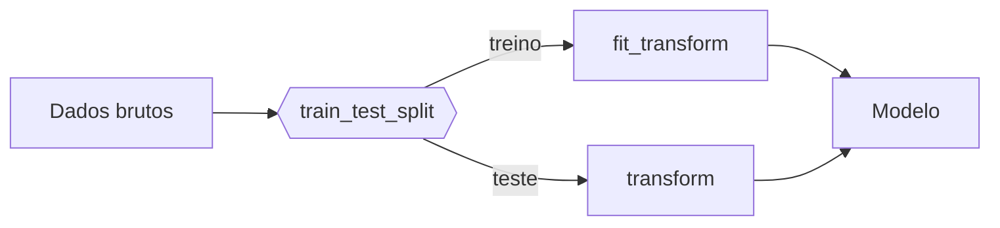

# 1. Data

!!! abstract "Enunciado"

    [Exercises → Data](https://insper.github.io/ann-dl/){:target='_blank'}

!!! tip "Este arquivo é o modelo de relatório"

## Exercise 1

### Abordagem

Os dados foram gerados utilizando o `rng.normal` e preenchendo a média (parâmetro loc), o desvio padrão (parâmetro scale) e o número de amostras (parâmetro size), todos dados no enunciado, realiza uma distribuição gaussiana (normal) e cria 100 amostras aleatórias de cada uma das 4 classes. Além disso, para alterar o quanto cada núvem espalha, o exercício dá um fator de escala e com isso, foram realizados 4 subgráficos com os desvios padrão multiplicados por cada fator de escala. A semente aleatória `seed=42` foi utilizada para garantir que os mesmos dados fossem reproduzidos.

### Código

O script vive em [`code/exercise1_point_clouds.py`](https://github.com/usuario/ann-dl/blob/main/docs/exercises/data/code/exercise1_point_clouds.py)
e é incluído aqui pelo próprio arquivo — nunca copie e cole o texto do código, use a
inclusão para que relatório e repositório nunca fiquem fora de sincronia.

``` { .python .copy .select linenums='1' title="docs/exercises/data/code/exercise1_point_clouds.py" }
--8<-- "docs/exercises/data/code/exercise1_point_clouds.py"
```

### Figuras


/// caption
**Figura 1** — Scatter plot 2D com todos os pontos, uma cor por classe, com o centro de cada núvem (média) marcado sobre o gráfico.
///


/// caption
**Figura 2** - 4 subplots (um por valor de `s`), compartilhando os mesmos limites de eixos, para que a comparação seja honesta.
///


/// caption
**Figura 3** - Gráfico de taxa de mistura x `s`.
///

A partir do fator `s`= 1 que as núvens começam a deixam de poder ser separadas por retas, pois a razão de mistura entre as classes começa a ser maior que 0, no caso, 0.0675.


///caption
**Figura adicional** - Scatter plot 2D com as fronteiras de decisão marcadas
///

### Análise

1. A sobreposição das quatro classes no dataset original ocorre de forma mais presente entre as classes 0, 1 e 2, especialmente as classes 0 e 1. No entanto, a classe 3 encontra-se totalmente isolada das demais. Uma única fronteira linear não seria o suficiente para separar todas as classes e um conjunto de de fronteiras lineares não seria perfeita para separar as classes 0 e 1 e classes 1 e 2, devido à sobreposição.

2. Figura adicional em Figuras.

3. Quanto mais espalhadas as núvens, maior é a região onde a rede necessariamente erra fica. Como pontos de diferentes classes ocupam posições similares, a reta não consegue distinguir exatamente de qual ponto é a classe deveria estar.

## Exercise 2

### Abordagem

### Código

### Figuras

### Análise

!!! note "Fronteiras não lineares"

    Para justificar por que as cascas concêntricas exigem fronteira não linear, ajuda
    escrever a condição de decisão. Um separador linear é

    $$
    f(\mathbf{x}) = \mathbf{w}^\top \mathbf{x} + b,
    $$

    enquanto a estrutura das cascas depende de $\lVert \mathbf{x} - \boldsymbol{\mu} \rVert$,
    que não é expressável nessa forma.

## Exercise 3

### Abordagem

### Código

### Figuras

### Análise

!!! warning "Vazamento de dados"

    O `train_test_split` vem **antes** de qualquer imputação, encoding ou escalonamento.
    Ajuste os transformadores só no treino e aplique-os ao teste.



## Results summary

Preencha **todas** as linhas — linha em branco é lida como exercício incompleto.

| # | Métrica | Valor |
|---|---------|-------|
| 1 | Separation ratio (`scale = 0.5`) | 0 |
| 2 | Separation ratio (`scale = 1.0`) | 0.0675 |
| 3 | Separation ratio (`scale = 2.0`) | 0.2250 |
| 4 | Taxa de mistura (`scale = 1.0`) | |
| 5 | Distância entre centros — gaussianas 5D | |
| 6 | Variância explicada — PC1 + PC2 | |
| 7 | Raio médio — casca interna | |
| 8 | Raio médio — casca externa | |
| 9 | Amostras de treino após o split | |
| 10 | Amostras de teste após o split | |
| 11 | Colunas com valores ausentes | |
| 12 | Features após o encoding | |
| 13 | Faixa das features após o escalonamento | |

## Discussão

O que foi difícil? Onde a intuição falhou? Que decisão você tomaria diferente?

## Conclusão

O que este exercício mostrou sobre a relação entre distribuição dos dados e a complexidade
da fronteira de decisão que a rede precisa aprender?